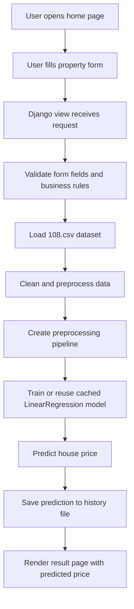

# 🏡✨ House Price Prediction Web App

[](https://opensource.org/licenses/MIT)

A full-stack Django application that predicts house prices from a small tabular dataset and displays the result through a modern web interface. The project combines a Django backend, HTML templates, and a machine-learning regressor trained on housing features such as budget, house age, BHK, population, city, and furnishing status.

## 1. Project Overview

This project is a practical example of how a web app can use machine learning for real-time prediction. The flow is:

1. A user enters property-related information in the form.
2. The Django backend validates the inputs.
3. The data is transformed into the feature format required by the model.
4. The trained regression pipeline predicts the house price.
5. The predicted value is shown on the page and saved in the history file.

---

## 2. Actual Architecture of the Project

### Backend
- Built with Django.
- Uses Python views to handle requests.
- Implements business logic for input validation, such as minimum budget checks by BHK and allowed value ranges.

### Frontend
- Simple HTML templates styled with custom CSS.
- The app has three main pages:
  - Home page
  - Prediction form/result page
  - Prediction history page

### Machine Learning Layer
- The app loads data from the CSV file.
- It cleans the dataset and builds a preprocessing pipeline.
- It trains a regression model inside the Django application logic.
- The trained model is cached to avoid retraining on every request when the dataset has not changed.

---

## 3. Mermaid Workflow Diagram


---

## 4. Features
- User-friendly interface to input house details.
- Real-time house price prediction powered by a trained machine learning model.
- Clean and responsive UI for ease of use.
- Stores prediction history in the database
- Displays previous predictions for review

---

# 🛠 5. Technologies Used

| Category | Technologies |
|--------|-------------|
| **Backend Framework** | Django, Python |
| **Machine Learning** | scikit-learn, pandas, numpy |
| **Frontend Styling** | HTML5, CSS3, Bootstrap |

---

## 6. Machine Learning Model Currently Used

### Current Model
- Model type: Linear Regression
- Library: scikit-learn
- Preprocessing:
  - Numeric columns are standardized with StandardScaler
  - Categorical columns are transformed with OneHotEncoder
  - Both are combined in a ColumnTransformer inside a Pipeline

### Why this model was chosen
This project uses Linear Regression because:

- the dataset is small and tabular,
- the task is a regression problem,
- the model is fast to train and fast to predict,
- it is easy to interpret,
- it requires fewer resources than more complex boosting models.

### Strengths
- Simple and understandable
- Good baseline model
- Easy to deploy
- Works well when relationships are roughly linear

### Limitations
- May underfit if the real relationship between price and features is nonlinear
- May not capture complex interactions between location, size, and furnishing
- May not perform as well as tree-based or boosting models on real-world housing data

---

## 7. Why the Current Approach Works

The current implementation is a solid baseline because it:

- handles mixed numeric and categorical data,
- uses a proper preprocessing pipeline,
- validates the input before prediction,
- caches the fitted model for efficiency,
- stores past predictions for reference.

This makes the app suitable for learning, prototyping, and simple deployment.

---

## 8. Better and More Powerful Models to Use

For a more accurate housing-price prediction system, the following models would be stronger than the current Linear Regression approach.

| Model | Why it can be better | Best use case |
|---|---|---|
| RandomForestRegressor | Captures nonlinear relationships and feature interactions | Strong baseline for tabular data |
| GradientBoostingRegressor | Improves performance by combining weak learners sequentially | Better accuracy than simple linear models |
| XGBoostRegressor | Very strong on structured/tabular data and often wins competitions | High-performance production-grade prediction |
| LightGBMRegressor | Fast, efficient, and excellent for tabular datasets | Large datasets or faster training needs |
| CatBoostRegressor | Excellent with categorical features and minimal preprocessing | Best choice for this project because city and furnishing are categorical |
| HistGradientBoostingRegressor | Fast and robust for medium-sized datasets | Good alternative when speed matters |

### Recommended Upgrade
The best next step for this project is likely to replace Linear Regression with CatBoostRegressor.

---

# 🚀 Installation & Setup

Follow these steps to get the project running on your local machine.
1. Clone the repository
2. Create a virtual environment and activate it.
3. Write Command : python manage.py runserver 
---

## Prerequisites

Make sure you have a `requirements.txt` file in your root directory containing:

```
Django>=4.0
pandas
numpy
scikit-learn
```

---

## Setup Instructions

### 1️⃣ Clone the repository

```bash
git clone https://github.com/yourusername/your-repo-name.git
cd your-repo-name
```

---

### 2️⃣ Create and activate a virtual environment

```bash
python -m venv venv
```

**On Windows**

```bash
venv\Scripts\activate
```

**On Mac/Linux**

```bash
source venv/bin/activate
```

---

### 3️⃣ Install Dependencies

```bash
pip install -r requirements.txt
```

---

### 4️⃣ Configure Django Settings

- Open your `settings.py` file.
- Make sure you use your own unique Django **SECRET_KEY**.

---

### 5️⃣ Train the Machine Learning Model

Before starting the server, you must generate the model files.

```bash
python train_model.py
```

---

### 6️⃣ Verify Model Generation

Check your project directory to see if **two `.pkl` files** have been generated.

- ✅ **IF YES:** Proceed to Step 7.  
- ❌ **IF NO:** Check that all imports are perfectly installed, then re-run the Python file.

---

### 7️⃣ Run the Development Server

```bash
python manage.py runserver
```

---

### 8️⃣ Open the Application

Visit in your browser:

```
http://127.0.0.1:8000/
```

---

# 📊 Machine Learning Model

The project uses a **Scikit-learn regression model** trained on housing data.  
The trained model is saved as `.pkl` files and loaded by the Django backend for real-time predictions.

---

# 📜 License

This project is licensed under the **MIT License**.

---

# ⭐ Contributing

Contributions are welcome!

If you'd like to improve this project:

1. Fork the repository  
2. Create a new branch  
3. Commit your changes  
4. Submit a Pull Request

---

# 💡 Future Improvements

- Deploy to **AWS / Render / Railway**
- Add **interactive price charts**
- Improve **ML model accuracy**
- Add **user authentication**

---

# 👨‍💻 Author

Developed with ❤️ using **Django + Machine Learning**.

## Very Important For YOU :
Ideas make projects better.

⚡ This project is only version **today**.  
Your idea could define version **tomorrow**.

Feel free to open an issue, suggest improvements, or submit a pull request. 

Contact through Email ID: rocket.20.launcher18@gmail.com
